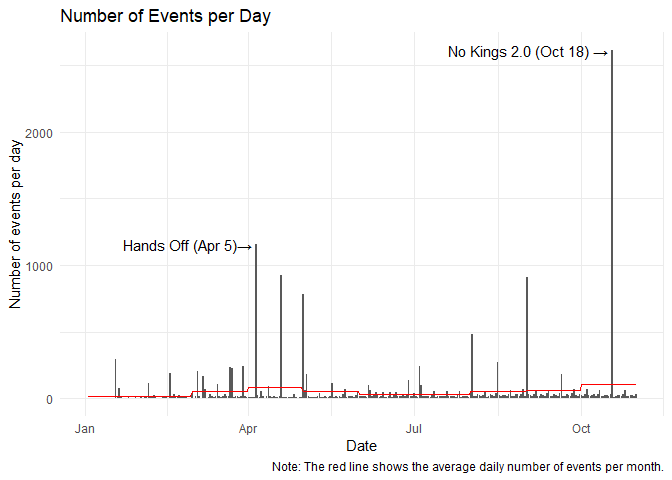
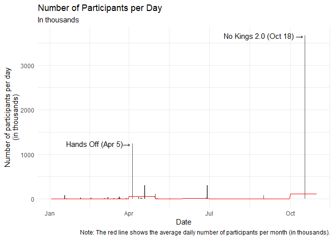
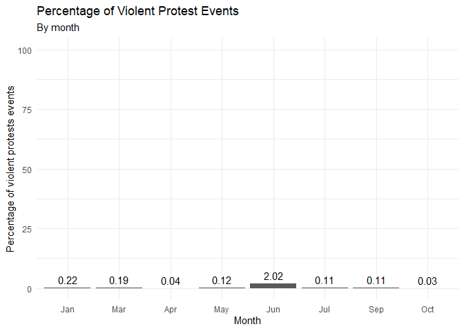
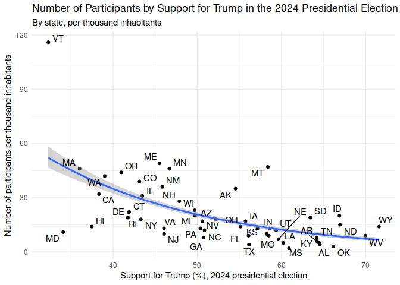
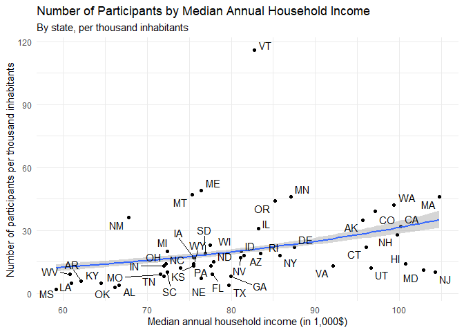
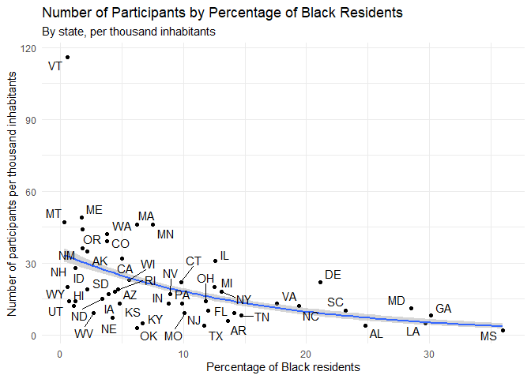
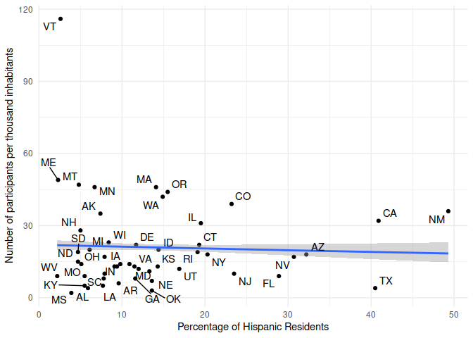
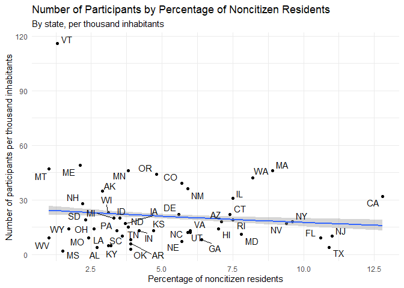
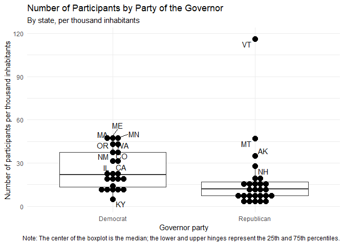
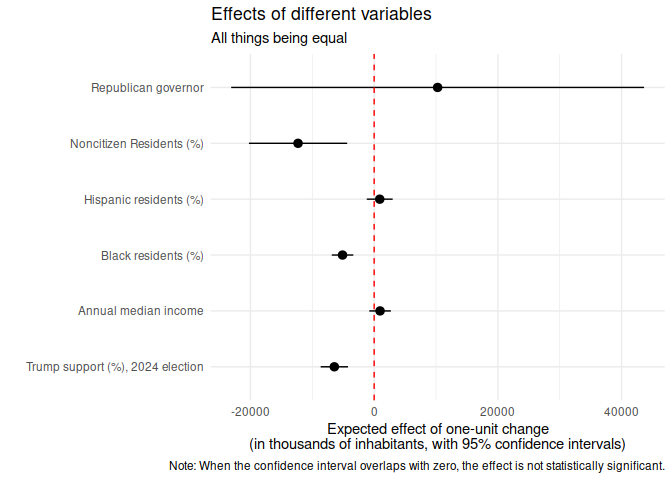

Protests against Trump, January 1st, 2025 to May 31st, 2025
================
Philippe Joly
2026-01-22

This project uses data from the Crowd Counting Consortium (CCC) to
analyze protests against Trump in 2025 (from January 1st, 2025 to
October 31st, 2025).

Sources:

- Erica Chenoweth, Soha Hammam, Jeremy Pressman, Christopher Shay, and
  Jay Ulfelder, 2025, “Crowd Counting Consortium U.S. Protest Event
  Data, 2025-”, <https://doi.org/10.7910/DVN/RI9JFU>, Harvard Dataverse,
  V11
- KFF. (2025). State Health Facts.
  <https://www.kff.org/state-health-facts/>
- American Presidency Project. (2024). 2024.
  <https://www.presidency.ucsb.edu/statistics/elections/2024>

## Trends over Time

### Figure 1

<!-- -->

### Figure 2

<!-- -->

### Figure 3

<!-- -->

## Geography of the Protests: Bivariate Relationships

### Figure 4

<!-- -->

### Figure 5

<!-- -->

### Figure 6

<!-- -->

### Figure 7

<!-- -->

### Figure 8

<!-- -->

### Figure 9

<!-- -->

## Geography of the Protests: Multivariate Analysis

### Figure 10

Results of a count model. Coefficients below zero indicate a negative
effect.

<!-- -->
