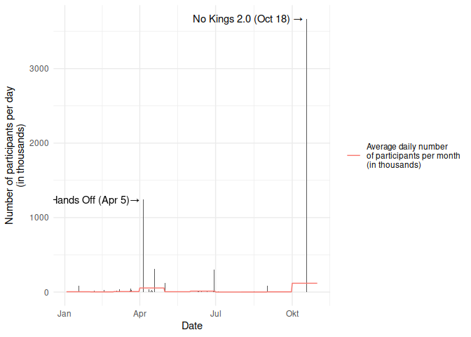

Protests against Trump, January 1st, 2025 to May 31st, 2025
================
Philippe Joly
2026-01-21

This project uses data from the Crowd Counting Consortium (CCC) to
analyze protests against Trump in 2025 (from January 1st, 2025 to
October 31st, 2025).

## Protests over Time

<!-- -->

## Bivariate Relationships

### Support for Trump (%), 2024 presidential election

<!-- -->

### Median Annual Household Income

<!-- -->

### Percentage of Black Residents

<!-- -->

### Percentage of Hispanic Residents

<!-- -->

## Percentage of Noncitizen Residents

<!-- -->

## Governor Party

<!-- -->

## Correlation Matrix

|  | n_part_pop | pct_trump | income | black | hispanic | non_citizens | republican_gov |
|----|----|----|----|----|----|----|----|
| n_part_pop | 1 | . | . | . | . | . | . |
| pct_trump | -.57 | 1 | . | . | . | . | . |
| income | .33 | -.70 | 1 | . | . | . | . |
| black | -.44 | .02 | -.24 | 1 | . | . | . |
| hispanic | -.04 | -.29 | .26 | -.11 | 1 | . | . |
| non_citizens | -.11 | -.50 | .56 | .08 | .77 | 1 | . |
| republican_gov | -.22 | .66 | -.41 | .11 | -.29 | -.40 | 1 |

## Multivariate Analysis

Results of a count model. Coefficients below zero indicate a negative
effect.

<!-- -->
