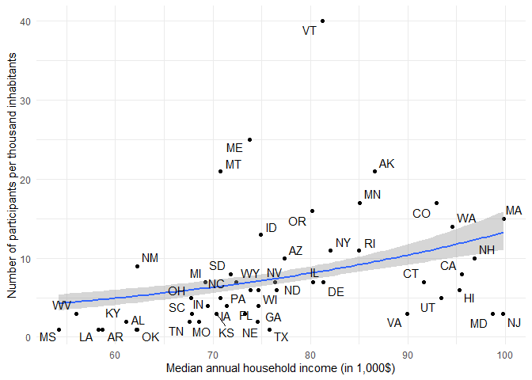

Protests against Trump, January 1st, 2025 to May 31st, 2025
================
Philippe Joly
2025-07-07

This project uses data from the Crowd Counting Consortium (CCC) to
analyze protests against Trump in 2025.

- The outcome variable is the number of participants per 1,000
  inhabitants from January 1st, 2025 to May 31st, 2025.

## Bivariate Relationships

### Support for Trump (%), 2024 presidential election

<!-- -->

### Median Annual Household Income

<!-- -->

### Percentage of Black Residents

<!-- -->

### Percentage of Hispanic Residents

<!-- -->

## Percentage of Noncitizen Residents

<!-- -->

## Governor Party

<!-- -->

## Correlation Matrix

|                | n_part_pop | pct_trump | income | black | hispanic | non_citizens | republican_gov |
|----------------|------------|-----------|--------|-------|----------|--------------|----------------|
| n_part_pop     | 1          | .         | .      | .     | .        | .            | .              |
| pct_trump      | -.47       | 1         | .      | .     | .        | .            | .              |
| income         | .33        | -.71      | 1      | .     | .        | .            | .              |
| black          | -.48       | .02       | -.25   | 1     | .        | .            | .              |
| hispanic       | -.10       | -.29      | .24    | -.12  | 1        | .            | .              |
| non_citizens   | -.05       | -.63      | .60    | .07   | .76      | 1            | .              |
| republican_gov | -.18       | .66       | -.41   | .11   | -.29     | -.41         | 1              |

## Multivariate Analysis

Results of a count model. Coefficients below zero indicate a negative
effect.

<!-- -->
